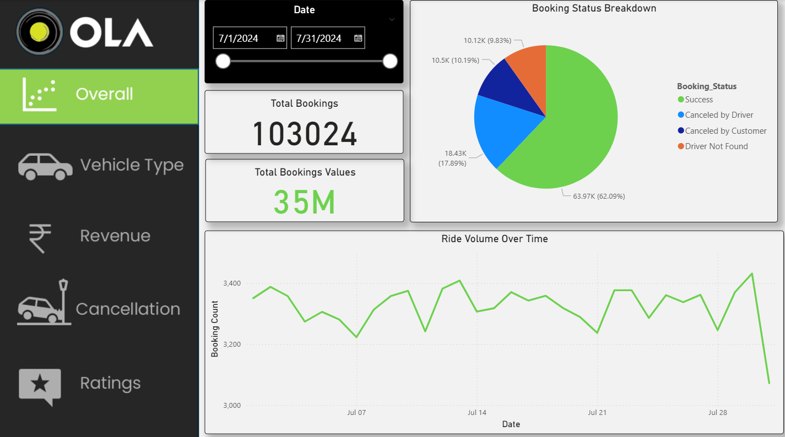
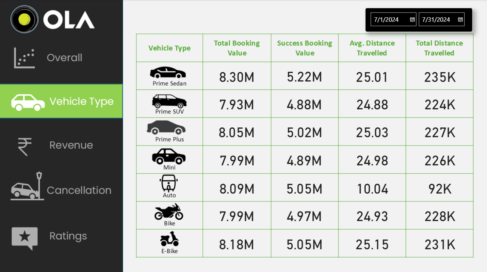
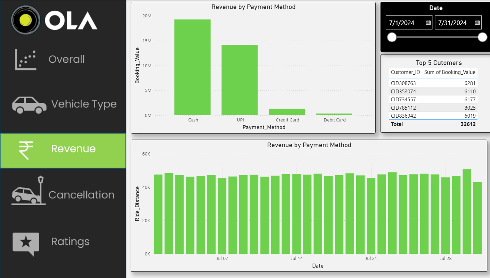
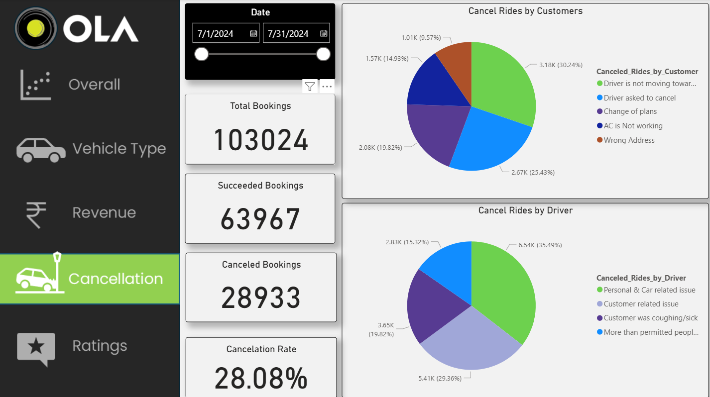
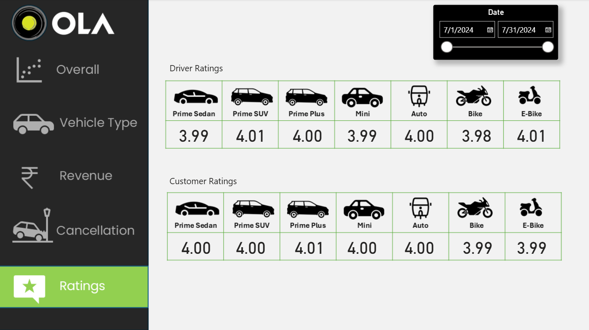

# Ola Data Analyst Project 🚖📊

## Project Overview
This project analyzes ride-hailing data (inspired by Ola) to extract insights into customer behavior, booking patterns, cancellations, and revenue trends. 

Tools used:
- MySQL (for querying data)
- Power BI (for visualization & dashboarding)

## SQL Questions Solved
1. Retrieve all successful bookings
2. Find the average ride distance for each vehicle type
3. Get the total number of cancelled rides by customers
4. List the top 5 customers who booked the highest number of rides
5. Get the number of rides cancelled by drivers due to personal and car-related issues
6. Find the maximum and minimum driver ratings for Prime Sedan bookings
7. Retrieve all rides where payment was made using UPI
8. Find the average customer rating per vehicle type
9. Calculate the total booking value of rides completed successfully
10. List all incomplete rides along with the reason

## Power BI Dashboard
- Ride Volume Over Time
- Booking Status Breakdown
- Top 5 Vehicle Types by Ride Distance
- Average Customer Ratings by Vehicle Type
- cancelled Rides Reasons
- Revenue by Payment Method
- Top 5 Customers by Total Booking Value
- Ride Distance Distribution Per Day
- Driver Ratings Distribution
- Customer vs. Driver Ratings

### Segregation of the views:
1. Overall
  
2. Vehicle Type
  
3. Revenue
  
4. Cancellation
  
5. Ratings
  

## Insights
- Majority of rides are booked via UPI (~45%).
- Prime Sedan has the highest cancellation rate.
- Top 5 customers account for 18% of total booking value.
- Weekends show peak booking demand.

---
